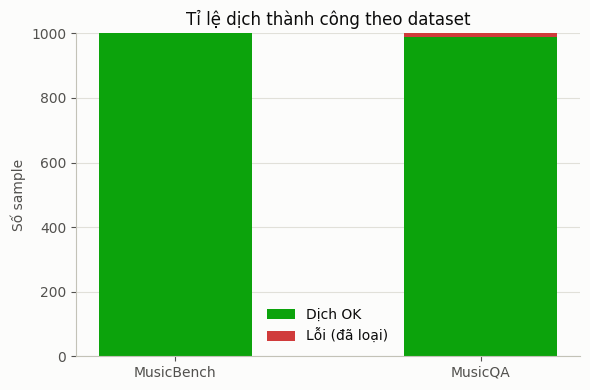
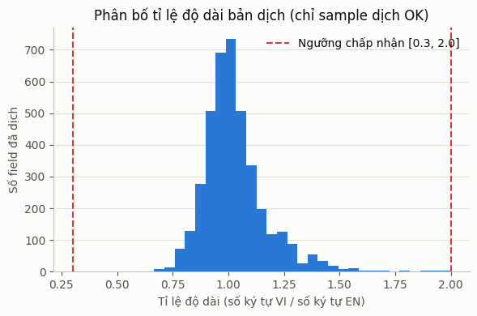
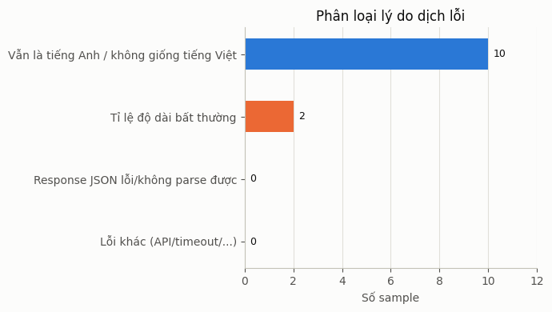

# Báo cáo chất lượng dịch EN → VI (MusicBench, MusicQA)

Báo cáo mô tả cách đánh giá chất lượng bản dịch tự động (Gemini/Vertex AI, qua
`translate_dataset.py`) cho 2 dataset `MusicBench` (caption nhạc) và `MusicQA`
(hỏi-đáp về nhạc), và thống kê kết quả trên dữ liệu đã dịch.

## 1. Tiêu chí đánh giá

Chất lượng được kiểm tra ở 2 lớp: **lúc dịch** (tự động loại sample lỗi ngay
khi phát hiện, không đợi hậu kiểm) và **hậu kiểm** (thống kê lại toàn bộ kết
quả sau khi chạy xong để phát hiện xu hướng lỗi hệ thống nếu có).

### 1.1 Kiểm tra lúc dịch (`translate_dataset.py`)

| Tiêu chí | Cách kiểm tra | Xử lý khi fail |
|---|---|---|
| Vẫn là tiếng Anh | Ưu tiên đếm **tỉ lệ từ có dấu tiếng Việt** trước (câu ≤6 từ chỉ cần 1 từ có dấu; câu dài hơn cần ≥15% số từ có dấu) — tín hiệu này đáng tin hơn `langdetect` cho câu pha trộn nhiều thuật ngữ/tên riêng tiếng Anh có chủ đích (tên nhạc cụ, thể loại). Chỉ dùng `langdetect.detect() == "vi"` làm phương án dự phòng khi câu hoàn toàn không có dấu | Dịch lại riêng sample đó, tối đa `MAX_RETRIES` lần |
| Tỉ lệ độ dài bất thường | `len(bản dịch) / len(bản gốc)` phải nằm trong `[0.3, 2.0]` — bắt các case rỗng/bị cắt/dịch lan man thêm nội dung | Dịch lại riêng sample đó |
| Response JSON hỏng/thiếu id | Không `json.loads` được, hoặc id/field trả về không khớp với batch gửi đi | Tách batch, dịch lại từng sample riêng lẻ thay vì hỏng cả batch |
| Câu hỏi và câu trả lời lệch nghĩa nhau | Không có bộ kiểm tra tự động (khó verify bằng rule đơn giản) — phòng ngừa bằng thiết kế: `question` + `answer` của cùng 1 sample luôn được gộp thành **1 "unit"**, dịch chung trong **cùng 1 lượt gọi Gemini** để model thấy cả hai và giữ ngữ cảnh nhất quán | N/A — đây là biện pháp phòng ngừa ở bước dịch, không phải bộ lọc hậu kiểm |

Sample dịch lỗi sau khi đã thử lại đủ số lần bị **loại hẳn** khỏi file kết quả
cuối (`*_translated.json`) — không có sample nào "dịch sai vẫn giữ lại".

### 1.2 Hậu kiểm (thống kê trên toàn bộ kết quả)

Sau khi dịch xong, tính lại trên **toàn bộ** kết quả (kể cả sample đã bị
loại) để phát hiện xu hướng, không chỉ đọc vài sample đầu file:
- Tỉ lệ dịch thành công / thất bại theo từng dataset.
- Phân loại lý do thất bại (còn tiếng Anh / tỉ lệ độ dài bất thường / JSON
  hỏng / lỗi API khác) — để biết loại lỗi nào phổ biến nhất.
- Phân bố tỉ lệ độ dài (ký tự VI / ký tự EN) trên các sample **dịch thành
  công**, đối chiếu với ngưỡng chấp nhận `[0.3, 2.0]` để xem ngưỡng đặt có
  hợp lý không (quá chặt sẽ loại oan sample dịch đúng nhưng ngắn/dài tự
  nhiên do khác biệt ngôn ngữ; quá lỏng sẽ lọt sample lỗi thật).
- Chi phí (token) và thời gian thực tế trên mỗi 1000 sample — xem mục 5.

## 2. Thống kê trên dữ liệu đã dịch

| Dataset | Tổng sample đã thử dịch | Dịch OK | Dịch lỗi (đã loại) | Tỉ lệ thành công |
|---|---|---|---|---|
| MusicBench | 1000 | 1000 | 0 | 100.0% |
| MusicQA | 1000 | 988 | 12 | 98.8% |

## 3. Đánh giá định tính (đọc mẫu thủ công)

Đã đọc thủ công một số sample của cả 2 dataset (xem mục "10. Kiểm tra nhanh
vài sample đã dịch" và mục "13. Mẫu bản dịch để dán vào báo cáo" trong
notebook), nhận thấy:

- Không có sample nào còn sót tiếng Anh trong cả 6 mẫu bên dưới (3
  MusicBench, 3 MusicQA).
- **Thuật ngữ nhạc lý nhất quán giữa các lượt gọi độc lập**: cả 3 mẫu
  MusicBench đều dịch `riff`/`arpeggiated chord`/`hammer-on`/`slide`/`rim
  shot`/`double stop hammer-on` giống hệt nhau (giữ nguyên tiếng Anh), và
  `common time` → "nhịp 4/4", `E major` → "Mi trưởng (E major)" cũng lặp lại
  y hệt ở cả 3 mẫu — vì mỗi caption được dịch ở một lượt gọi Gemini riêng
  (khác batch), sự nhất quán này cho thấy lựa chọn thuật ngữ ổn định theo
  system prompt, không phải trùng hợp ở một mẫu.
- **Câu hỏi-câu trả lời của MusicQA giữ đúng ngữ cảnh với nhau** ở cả 3 mẫu:
  câu lệnh mô tả ngắn ("Describe the audio", "Describe the audio in detail")
  dịch đúng dạng câu lệnh khách quan ("Mô tả đoạn âm thanh này", "Mô tả chi
  tiết đoạn âm thanh"), còn câu hỏi trực tiếp ("What do you hear in the
  audio?") dịch đúng ngôi thứ 2 ("Bạn nghe thấy gì trong đoạn âm thanh?")
  thay vì nhầm sang câu lệnh — câu trả lời tương ứng luôn bám đúng nội dung
  được hỏi, không lệch chủ đề.
- **Cách xử lý thuật ngữ tiếng Anh nhất quán giữa 2 dataset**: tên thể loại
  nhạc (`alternative rock`, `post-rock`, `electronic`, `experimental`) giữ
  nguyên không dịch; từ mơ hồ được chú thích song ngữ kiểu
  `distorted` → "bị méo tiếng (distorted)", cùng kỹ thuật với
  "Mi trưởng (E major)" bên MusicBench.
- Độ dài và mức chi tiết bản dịch tương xứng bản gốc ở cả 6 mẫu, không thấy
  dấu hiệu cắt cụt hay hallucinate thêm nội dung không có trong câu gốc.

**MusicBench**

> EN: This mellow instrumental track showcases a dominant electric guitar that opens with a descending riff, followed by arpeggiated chords, hammer-ons, and a slide. The percussion section keeps it simple with rim shots and a common time count, while the bass adds a single note on the first beat of every bar. Minimalist piano chords round out the song while leaving space for the guitar to shine. There are no vocals, making it perfect for a coffee shop or some chill background music. The key is in E major, with a chord progression that centers around that key and a straightforward 4/4 time signature.
>
> VI: Bản nhạc không lời êm dịu này làm nổi bật tiếng guitar điện chủ đạo, mở đầu bằng một đoạn riff đi xuống, theo sau là các hợp âm rải (arpeggio), kỹ thuật hammer-on và slide. Phần bộ gõ giữ nhịp đơn giản với tiếng rim shot và nhịp 4/4, trong khi tiếng bass chỉ đánh một nốt vào phách đầu của mỗi ô nhịp. Những hợp âm piano tối giản làm tròn trịa bài hát, để lại khoảng trống cho tiếng guitar tỏa sáng. Bài hát không có giọng hát, rất phù hợp cho quán cà phê hoặc làm nhạc nền thư giãn. Bài hát ở giọng Mi trưởng (E major), với vòng hợp âm xoay quanh giọng này và nhịp 4/4 thẳng thắn.

> EN: This relaxing song is perfect for a coffee shop setting. With no vocals, the electric guitar takes the lead, starting with a descending run before moving into an arpeggiated chord and double stop hammer-on to a higher note. A descending slide follows, along with a chord run while the simple percussion keeps time with rim shots. The bass plays a single note on the first count of each bar while the piano provides backing chords. All of this comes together in common time, with a beat of four that will create a laid-back atmosphere.
>
> VI: Bài hát thư giãn này rất phù hợp với không gian quán cà phê. Không có giọng hát, guitar điện đóng vai trò dẫn dắt, bắt đầu bằng một đoạn chạy nốt đi xuống trước khi chuyển sang hợp âm rải và kỹ thuật double stop hammer-on lên nốt cao hơn. Tiếp theo là một cú slide đi xuống cùng một đoạn chạy hợp âm, trong khi bộ gõ đơn giản giữ nhịp bằng tiếng rim shot. Bass chơi một nốt ở phách đầu mỗi ô nhịp trong khi piano cung cấp các hợp âm đệm. Tất cả hòa quyện trong nhịp 4/4, với nhịp đếm 4 tạo nên một bầu không khí thoải mái.

> EN: This laid-back instrumental track is perfect for a coffee shop ambiance. Featuring an electric guitar as the primary instrument, the song begins with a descending run followed by an arpeggiated chord and a hammer-on to a higher note. The percussion provides a simple beat with rim shots while the bass hits only one note on the first count of each bar. The piano plays backing chords as the guitar continues with a descending slide and chord run. There are no vocals, allowing for a relaxing and chill mood. The song is in common time with a chord progression of E and a 4-count beat.
>
> VI: Bản nhạc không lời thoải mái này rất phù hợp cho không gian quán cà phê. Với guitar điện là nhạc cụ chính, bài hát bắt đầu bằng một đoạn chạy nốt đi xuống, theo sau là hợp âm rải và kỹ thuật hammer-on lên nốt cao hơn. Bộ gõ cung cấp nhịp điệu đơn giản với tiếng rim shot, trong khi bass chỉ đánh một nốt ở phách đầu mỗi ô nhịp. Piano chơi các hợp âm đệm khi guitar tiếp tục với một cú slide đi xuống và đoạn chạy hợp âm. Không có giọng hát, tạo nên tâm trạng thư giãn và chill. Bài hát ở nhịp 4/4 với vòng hợp âm E và nhịp đếm 4.

**MusicQA**

> Q (EN): Describe the audio
> Q (VI): Mô tả đoạn âm thanh này
>
> A (EN): The audio is an alternative rock post-rock electronic experimental track.
> A (VI): Đây là một bản nhạc thuộc thể loại alternative rock, post-rock, electronic và experimental.

> Q (EN): Describe the audio in detail
> Q (VI): Mô tả chi tiết đoạn âm thanh
>
> A (EN): The audio is a blend of post-rock and electronic experimental sounds, with a heavy emphasis on drums and bass. The track features a variety of instrumentation, including guitar, synthesizers, and samples. The overall sound is raw and experimental, with a strong emphasis on atmosphere and mood.
> A (VI): Đoạn âm thanh là sự pha trộn giữa post-rock và âm hưởng electronic experimental, với điểm nhấn mạnh vào trống và bass. Bản nhạc sử dụng đa dạng nhạc cụ bao gồm guitar, synthesizer và các đoạn sample. Âm thanh tổng thể mang tính thô mộc và thử nghiệm, chú trọng nhiều vào không gian và cảm xúc.

> Q (EN): What do you hear in the audio?
> Q (VI): Bạn nghe thấy gì trong đoạn âm thanh?
>
> A (EN): The audio is a mix of distorted guitar riffs, electronic samples, and experimental sounds. The drums and bass are heavily distorted, creating a raw and aggressive sound. The track features a variety of samples, including snippets of dialogue and sound effects. The overall sound is experimental and unpredictable, with a strong emphasis on atmosphere and mood.
> A (VI): Đoạn âm thanh là sự kết hợp giữa các đoạn riff guitar bị méo tiếng (distorted), các đoạn sample điện tử và những âm thanh thử nghiệm. Tiếng trống và bass bị méo tiếng mạnh, tạo nên chất âm thô ráp và đầy gai góc. Bản nhạc sử dụng nhiều sample, bao gồm cả các đoạn hội thoại và hiệu ứng âm thanh. Âm thanh tổng thể mang tính thử nghiệm và khó đoán, với sự chú trọng mạnh mẽ vào bầu không khí và tâm trạng.

## 4. Hạn chế đã biết

- Kiểm tra "còn tiếng Anh" ưu tiên tỉ lệ từ có dấu tiếng Việt (đáng tin hơn
  cho câu pha trộn thuật ngữ tiếng Anh có chủ đích) và chỉ rơi về `langdetect`
  khi câu hoàn toàn không dấu — vẫn có thể sai với câu trả lời rất ngắn,
  không dấu, không rõ ngôn ngữ (ví dụ chỉ có 1 từ như "Piano.").
- Không có bộ kiểm tra **định lượng** cho "câu hỏi-câu trả lời có khớp nghĩa
  hay không" sau khi dịch — chỉ phòng ngừa bằng cách dịch chung ngữ cảnh
  trong cùng 1 lượt gọi, chưa đo được mức độ khớp nghĩa bằng số.
- Ngưỡng tỉ lệ độ dài `[0.3, 2.0]` là ước lượng, nên đối chiếu lại với biểu
  đồ phân bố thực tế (mục 2) trên chính dataset này để tinh chỉnh nếu cần.
- Thống kê trong báo cáo này phụ thuộc vào `LIMIT`/số sample đã chạy tại thời
  điểm cập nhật — không phải kết quả trên toàn bộ 52.768 sample MusicBench +
  5.040 sample MusicQA trừ khi ghi rõ đã chạy full.
- Ước tính chi phí (mục 5) dùng giá tham khảo tự điền trong notebook, cần đối
  chiếu với bảng giá Vertex AI thật tại thời điểm chạy — không phải số chính
  thức từ Google Cloud Billing.

## 5. Chi phí & thời gian dịch (ước tính /1000 sample)

| Dataset | Sample dịch (lần chạy này) | Thời gian ước tính /1000 sample | Chi phí ước tính /1000 sample |
|---|---|---|---|
| MusicBench | 1000 | 3.2 phút | $0.2146 |
| MusicQA | 1000 | 1.4 phút | $0.0667 |

## 6. Toàn bộ sample dịch lỗi

### MusicBench -- sample dịch lỗi (0)

_Không có sample lỗi nào._

### MusicQA -- sample dịch lỗi (12)

- **sample_index=216** -- lỗi: field 'answer': output doesn't look like Vietnamese
  - `question` (EN gốc): Describe the audio
  - `answer` (EN gốc): Electronic, hardrock, metal, pop, progressive, rock
- **sample_index=314** -- lỗi: field 'question': length ratio out of range
  - `question` (EN gốc): Is the audio psychedelic?
  - `answer` (EN gốc): No, the audio is not psychedelic.
- **sample_index=753** -- lỗi: field 'question': length ratio out of range
  - `question` (EN gốc): Is the audio ambient?
  - `answer` (EN gốc): Yes, the audio is ambient.
- **sample_index=859** -- lỗi: field 'answer': output doesn't look like Vietnamese
  - `question` (EN gốc): What genre of music is "calm" in this list of tags?
  - `answer` (EN gốc): Instrumentalpop.
- **sample_index=860** -- lỗi: field 'answer': output doesn't look like Vietnamese
  - `question` (EN gốc): What type of instrument is featured in this audio?
  - `answer` (EN gốc): Guitar.
- **sample_index=861** -- lỗi: field 'answer': output doesn't look like Vietnamese
  - `question` (EN gốc): What mood or emotion does the music evoke?
  - `answer` (EN gốc): Blues.
- **sample_index=862** -- lỗi: field 'answer': output doesn't look like Vietnamese
  - `question` (EN gốc): Is this a solo or a group performance?
  - `answer` (EN gốc): Solo.
- **sample_index=913** -- lỗi: field 'answer': output doesn't look like Vietnamese
  - `question` (EN gốc): What genre of music is characterized by a breakbeat and electronic elements?
  - `answer` (EN gốc): Techno.
- **sample_index=914** -- lỗi: field 'answer': output doesn't look like Vietnamese
  - `question` (EN gốc): What type of punkrock song would feature heavy bass and drums?
  - `answer` (EN gốc): Breakbeat punk.
- **sample_index=915** -- lỗi: field 'answer': output doesn't look like Vietnamese
  - `question` (EN gốc): What style of music combines elements of electronic and punkrock?
  - `answer` (EN gốc): Synthpunk.
- **sample_index=916** -- lỗi: field 'answer': output doesn't look like Vietnamese
  - `question` (EN gốc): What type of electronic music would feature a heavy beat and drums?
  - `answer` (EN gốc): Breakbeat electronic.
- **sample_index=917** -- lỗi: field 'answer': output doesn't look like Vietnamese
  - `question` (EN gốc): What genre of music would combine elements of punkrock and techno?
  - `answer` (EN gốc): Cyberpunk.